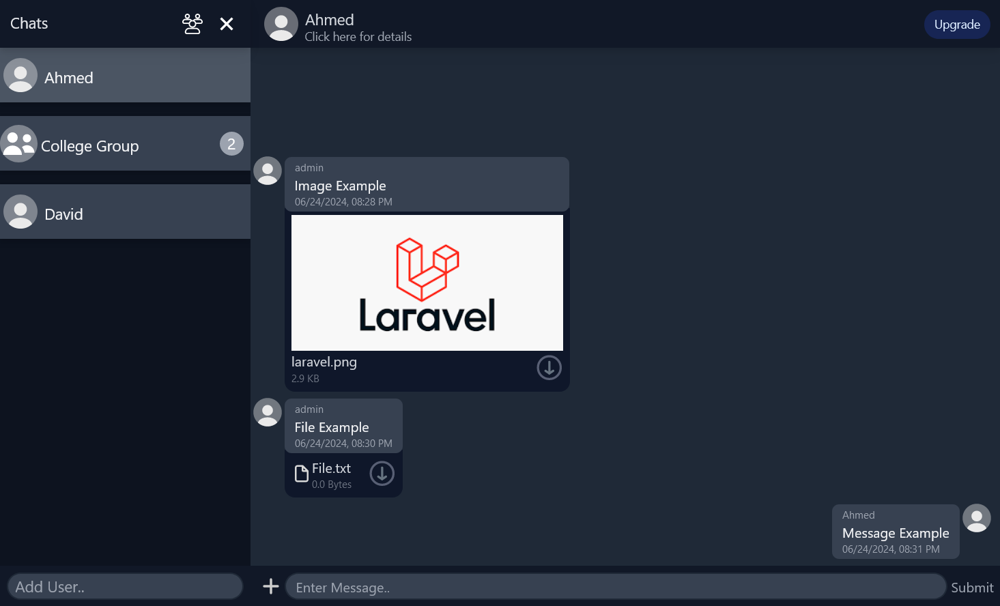
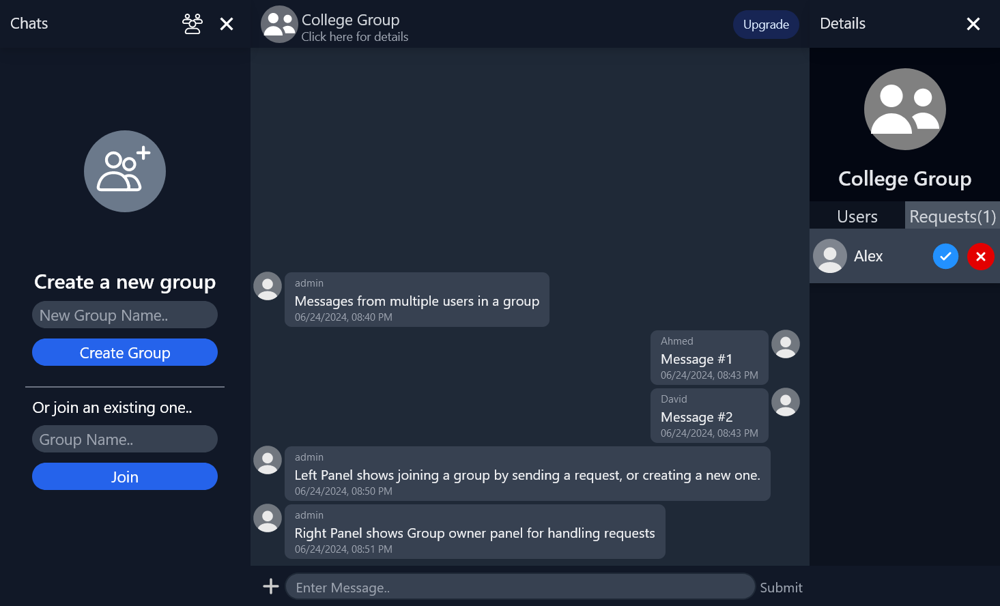
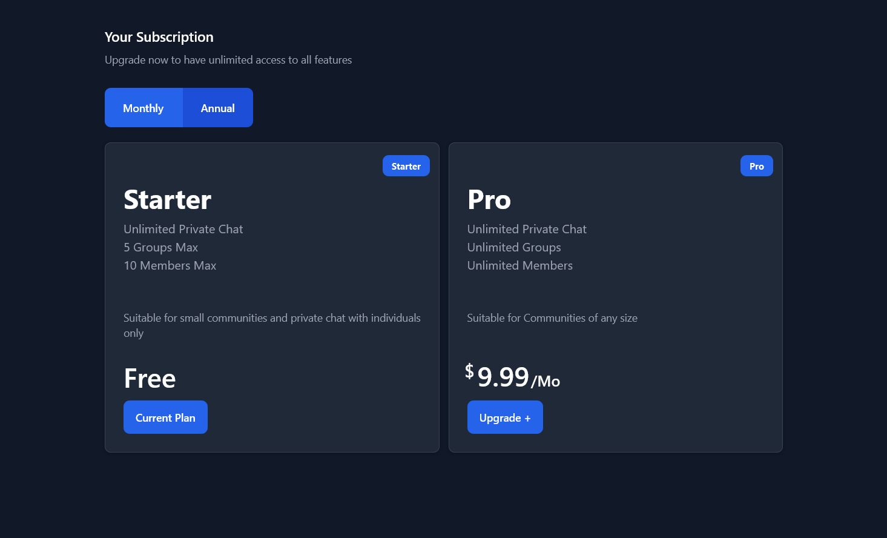

<a id="readme-top"></a>
<br />
<div align="center">
</div>


<details>
  <summary>Table of Contents</summary>
  <ol>
    <li>
      <a href="#about-the-project">About The Project</a>
      <ul>
        <li><a href="#built-with">Built With</a></li>
      </ul>
    </li>
    <li><a href="#installation">Getting Started</a>    </li>
    <li><a href="#usage">Usage</a></li>
    <li><a href="#contact">Contact</a></li>
  </ol>
</details>


## About The Project
An expansive Chat App with features including file uploads, private chat groups, and a subscription system for upgrading account.<br class-> File uploads powered by Backblaze CDN.<br>
Websocket services provided by Pusher.<br>
Subscription System powered by 2Checkout Payment Gateway. 

<p align="right">(<a href="#readme-top">back to top</a>)</p>


### Built With

[![Laravel]][Laravel-url]
[![Vue.js]][Vue-url]
[![tailwindcss]][Tailwind-url]


<p align="right">(<a href="#readme-top">back to top</a>)</p>


### Installation
   
1. Install Composer, PHP and NPM

1. Install Composer Packages
   ```sh
   composer update 
   ```
2. Run Migrations
   ```js
   php artisan migrate
   ```

4. Build Front-end files 
   ```js
   npm run build
   ```

3. Run Server
   ```js
   php artisan serve
   ```


<p align="right">(<a href="#readme-top">back to top</a>)</p>

## Usage
<h3 style="margin-top:0">1. Sending Message:</h3>

To send messages, enter name of a user at Chats panel, if the user exists it will be added to the list, click it then start sending messages. Click the plus sign to upload files.  

<h3 style="margin-top:0.5rem margin-bottom:0">2. Creating and joining a Group:</h3>



Click group icon at top of chats panel, then create a new group, or enter name of an existing group to send a join request to its owner. Owner will then receive the request on group's details panel on the right 


<h3 style="margin-top:0.5rem margin-bottom:0">3. Upgrading account:</h3>


Click Upgrade to open sandbox 2checkout gateway, <br>use testing card number: 6011111111111117, with name: John Doe.<br> Fill email with your chat account's email.<br> Fill remaining inputs with any value then place order.<br> Your account should now say upgraded at top of chat page.

<p align="right">(<a href="#readme-top">back to top</a>)</p>


## Contact

Whatsapp: 01228473230<br>
Linkedin: [linkedin.com/in/ahmed-hassan-abozed-6271b223a](https://www.linkedin.com/in/ahmed-hassan-abozed-6271b223a)<br>
Project Link: [github.com/AhmdAbozed/chat-vue-laravel](https://github.com/AhmdAbozed/chat-vue-laravel)<br>

<p align="right">(<a href="#readme-top">back to top</a>)</p>


[Vue.js]: https://img.shields.io/badge/Vue.js-4FC08D?style=for-the-badge&logo=vuedotjs&logoColor=white
[Vue-url]: https://vuejs.org/
[tailwindcss]: https://img.shields.io/badge/Tailwindcss-06B6D4?style=for-the-badge&logo=tailwindcss&logoColor=white
[Tailwind-url]: https://tailwindcss.com/
[Laravel]: https://img.shields.io/badge/Laravel-FF2D20?style=for-the-badge&logo=laravel&logoColor=white
[Laravel-url]: https://laravel.com/
